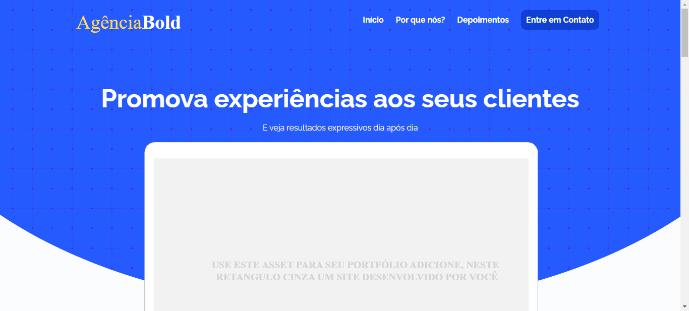
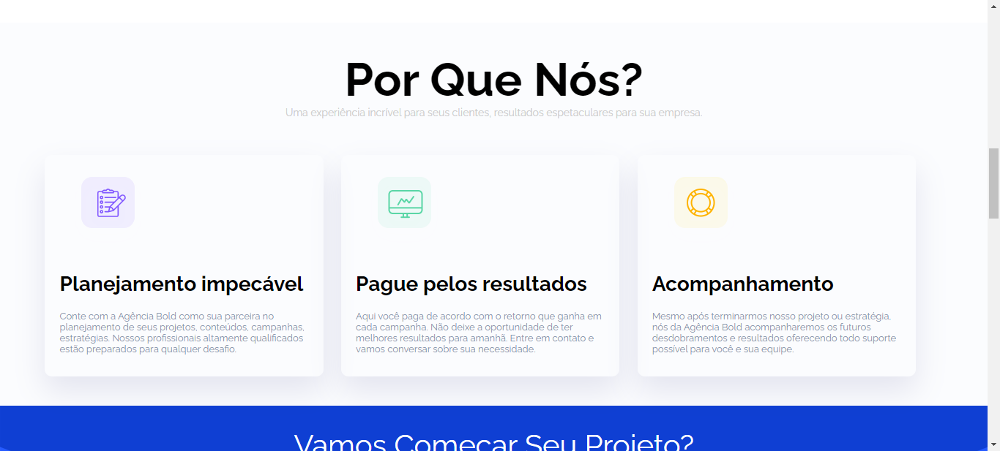
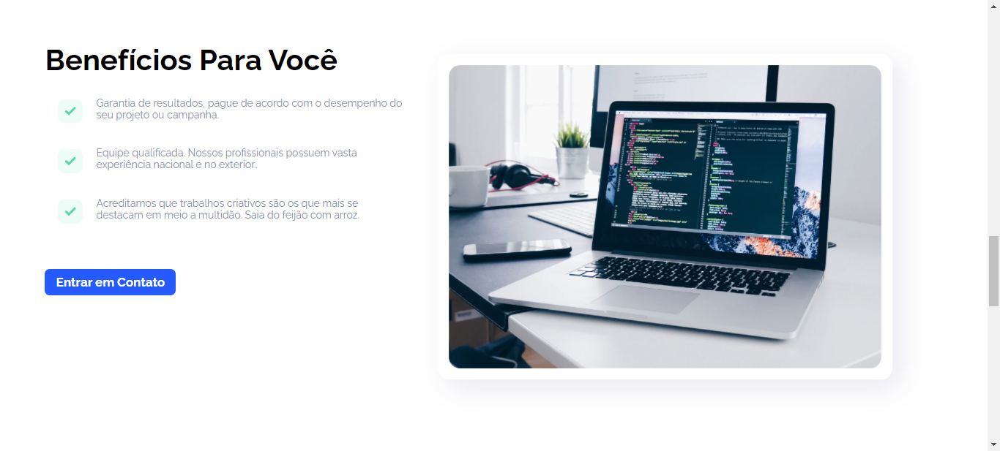
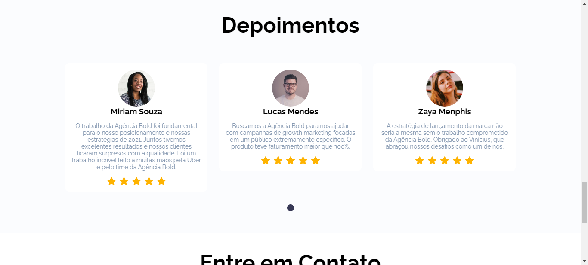
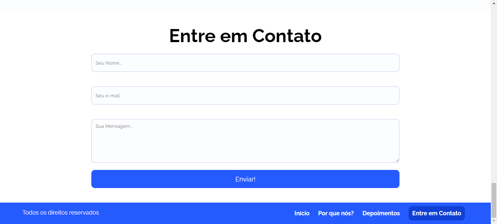
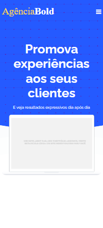
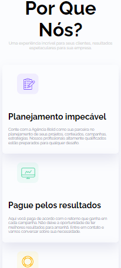
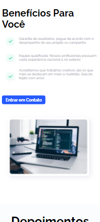
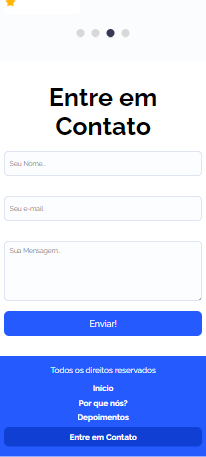

# WEBSITE FEITO EM HTML5, CSS3, JAVASCRIPT E JQUERY

Um Website desenvolvido em HTML5, CSS3, Javascript e JQuery, de forma totalmente responsiva para qualquer dispositivo.

## Imagens do Website

Computer Version:
 

Smartphone Version:
 

## Feito Com:

## 🔖 Licença

### Support Ou Contato

Copyright © 2022 leandroaugusto-souza

